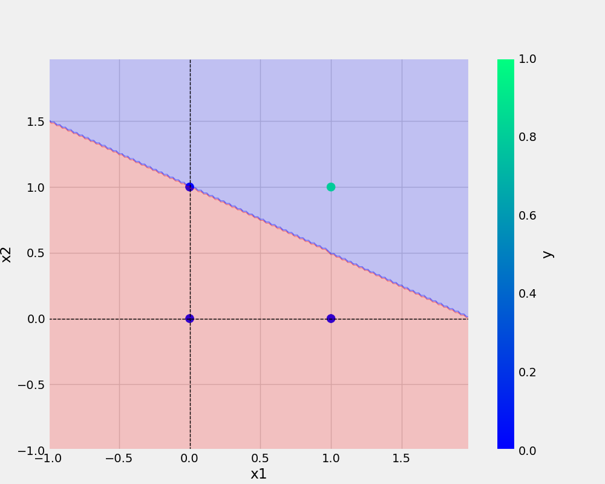

# oneNeuron
oneNeuron | Perceptron

# Commands Used
git add . && git commit -m "docstring updated" && git push origin main

# Add URL
[Git Handbook](https://guides.github.com/introduction/git-handbook/)

<a href="https://www.w3schools.com">Visit W3Schools.com</a>


# Add Image



# Add Python code

```python
def main(data,eta,epochs,filename,plotfileName):
    df = pd.DataFrame(data)
    print(df)
    X, y = prepare_data(df)
    model = Perceptron(eta=eta, epochs=epochs)
    model.fit(X, y)
    _ = model.total_loss()
    save_model(model, filename)
    save_plot(df, plotfileName, model)
```    

## dataset

x1 | x2 | y
-|-|-
0|0|0
0|0|1
0|1|0
0|1|1
1|1|1

###
* point 1
* point 2

1. point


